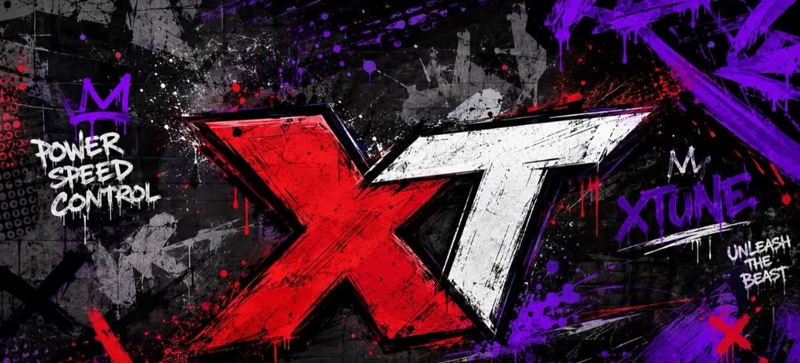

# PLANET XTUNE ECU — Site Oficial

Site institucional de alto nível da **Planet Xtune ECU** — referência nacional em calibração de ECU, desenvolvimento de softwares automotivos, acertos em dinamômetro, injeções programáveis (FuelTech, InjePro, Athlon, Servitec) e performance para motocicletas de alta cilindrada. Recordista Nacional Moto 600cc.



---

## 🏁 Stack Tecnológica

- **Framework:** [Next.js 14](https://nextjs.org/) (App Router)
- **Linguagem:** [TypeScript](https://www.typescriptlang.org/)
- **Estilização:** [Tailwind CSS](https://tailwindcss.com/) com paleta motorsport dark
- **Animações & Interações:** [Framer Motion](https://www.framer.com/motion/)
- **Ícones:** [Lucide React](https://lucide.dev/)
- **SEO & Otimização:** Metadata API, Open Graph, Twitter Cards, Schema.org (`AutoRepair` & `Service`), `sitemap.xml` e `robots.txt`
- **Deploy:** Otimizado para hospedagem na [Vercel](https://vercel.com/)

---

## ⚡ Seções do Site

1. **Header & Navbar:** Menu responsivo com efeito blur no scroll e menu mobile fullscreen
2. **Hero:** *"PERFORMANCE SEM LIMITES."*, arte oficial de fundo, telemetria em tempo real e CTAs diretos
3. **Faixa de Números (Prova Social):** +1.000 Motos, Recorde Nacional 600cc, Especialistas em ECU e 100% Performance
4. **"Não é Só Remap":** 4 pilares da calibração (Precisão, Tecnologia, Experiência e Resultado)
5. **O Que a Xtune Faz:** 8 cards detalhados de serviços especializados
6. **XTune Lite:** Seção exclusiva com mockup de notebook para o software Honda Denso (160/300)
7. **Ecossistema & Marcas:** FuelTech, InjePro, Athlon, Servitec + BMW, Yamaha, Kawasaki, Ducati, Honda
8. **Projetos & Resultados:** Galeria de projetos reais com dados comprovados
9. **Galeria Editorial:** Grid assimétrico com modal Lightbox em alta definição
10. **Por Trás da Performance:** Metodologia científica em 4 etapas + sala de dinamômetro
11. **Autoridade:** Credenciais, troféus de recorde nacional e backup vitalício da central original
12. **"Qual é o Seu Projeto?":** Seletor de motocicletas interativo integrado ao formulário
13. **Formulário de Orçamento:** Gerador instantâneo de lead para WhatsApp com confirmação visual
14. **Feed do Instagram:** Grade conectada a `@planet.xtune.ecu`
15. **Localização & Contato:** Maringá - PR com mapa escuro estilizado e horários
16. **FAQ Técnico:** 10 perguntas e respostas com embasamento de engenharia
17. **Footer:** Rodapé completo com logo XT, links rápidos e certificações
18. **WhatsApp Flutuante:** Botão fixo com pulso luminoso no canto inferior direito

---

## 🛠️ Manutenção dos Dados (CMS-Ready)

Todos os dados, textos, especificações de produtos, links de contato e números de WhatsApp estão centralizados em um único arquivo:
```
src/data/site-content.ts
```

---

## 🚀 Como Executar Localmente

### 1. Clonar o repositório
```bash
git clone https://github.com/DDMONEEY/Remap.git
cd Remap
```

### 2. Instalar as dependências
```bash
npm install
```

### 3. Executar o servidor de desenvolvimento
```bash
npm run dev
```
Acesse [http://localhost:3000](http://localhost:3000) no navegador.

### 4. Build de Produção
```bash
npm run build
npm run start
```

---

## 🌐 Deploy na Vercel

O projeto está 100% preparado para deploy na Vercel:
1. Conecte o repositório GitHub `DDMONEEY/Remap` na [Vercel](https://vercel.com).
2. O framework preset será detectado automaticamente como **Next.js**.
3. Clique em **Deploy**.

---

© Planet Xtune ECU — Performance Sem Limites. Todos os direitos reservados.
